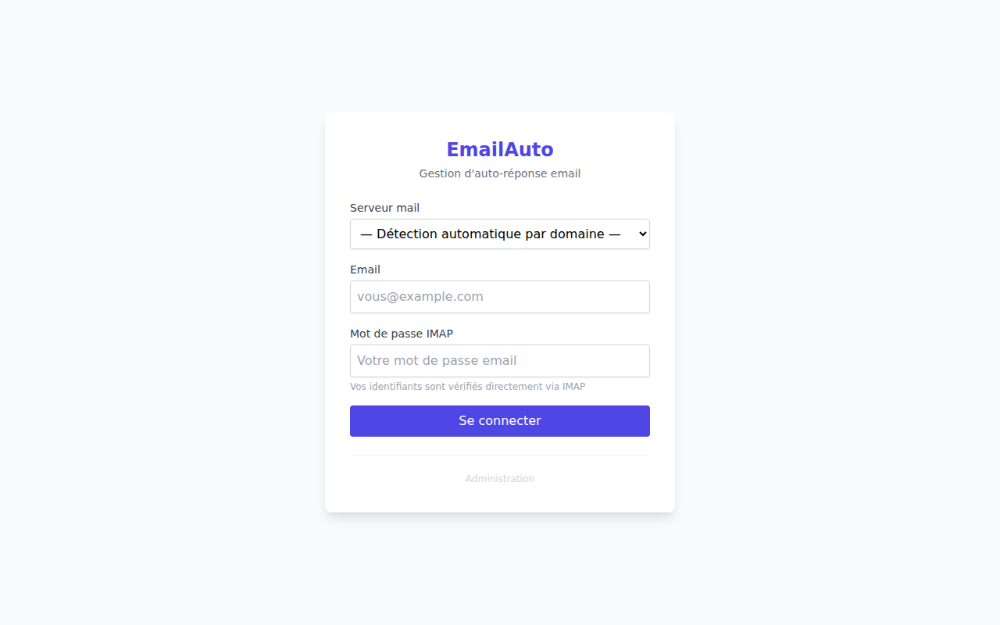
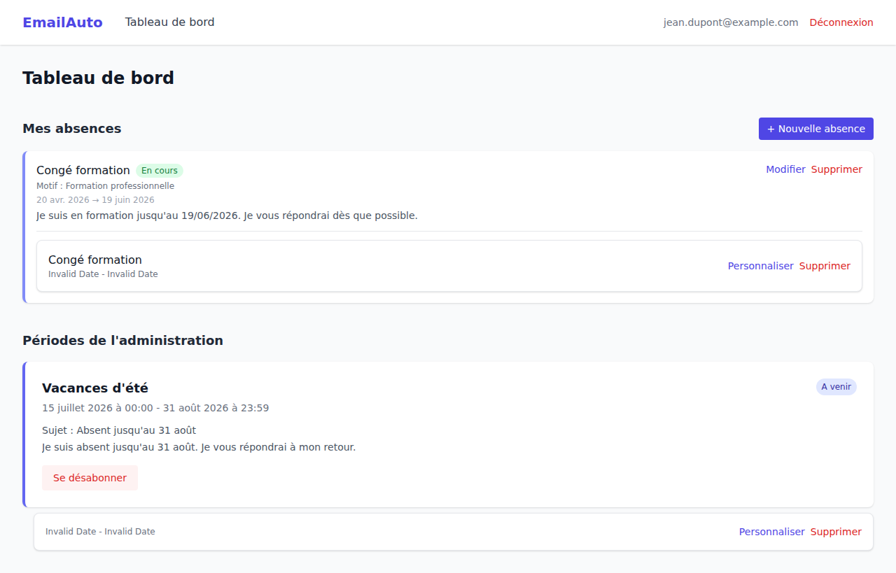

# Guide utilisateur — EmailAuto

EmailAuto vous permet d'activer des réponses automatiques pendant vos absences.

---

## Connexion

Rendez-vous sur la page d'accueil et connectez-vous avec votre adresse email et votre **mot de passe IMAP** (le mot de passe de votre compte email).

> Vos identifiants sont vérifiés directement via le serveur IMAP — l'application ne stocke pas votre mot de passe en clair.

---

## Tableau de bord

Une fois connecté, le tableau de bord présente deux sections :

### Mes absences

Gérez vos propres périodes d'absence. Pour chaque période, vous pouvez définir :

- Un nom et une raison
- Les dates de début et de fin
- L'objet et le message de l'auto-réponse

Cliquez sur **+ Nouvelle absence** pour en créer une. Chaque période peut être activée ou désactivée indépendamment.

### Périodes de l'administration

Ce sont les périodes de fermeture configurées par votre administrateur (congés scolaires, fermetures d'établissement…). Vous pouvez vous y **abonner** pour que vos auto-réponses s'activent automatiquement pendant ces périodes.

Une fois abonné, vous pouvez personnaliser l'objet et le message envoyé pour chaque abonnement.

---

> Les screenshots de ce guide sont générés automatiquement à chaque mise à jour de l'application.
