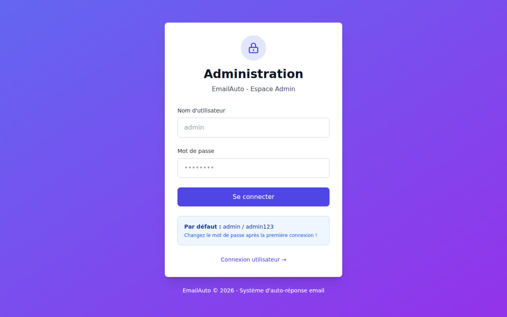
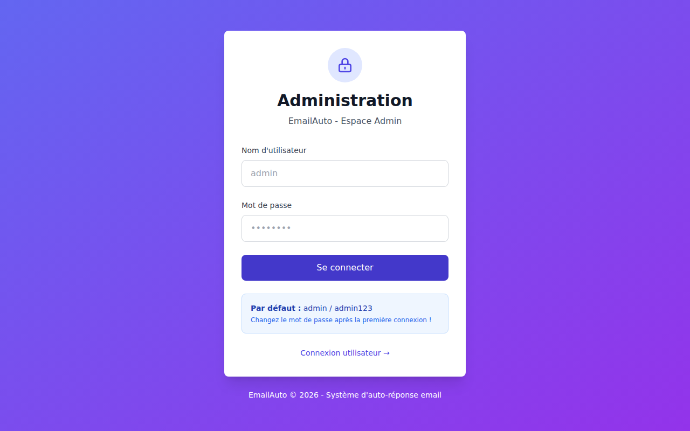

# Guide utilisateur — EmailAuto

EmailAuto est une application de gestion d'auto-réponses email. Elle permet aux utilisateurs d'activer des réponses automatiques pendant leurs absences, et aux administrateurs de configurer des périodes de fermeture collectives.

---

## Connexion

Rendez-vous sur la page d'accueil et connectez-vous avec votre adresse email et votre **mot de passe IMAP** (le mot de passe de votre compte email).

> Vos identifiants sont vérifiés directement via le serveur IMAP — l'application ne stocke pas votre mot de passe en clair.

---

## Tableau de bord

Une fois connecté, le tableau de bord vous présente deux sections :

### Mes absences

Gérez vos propres périodes d'absence personnelles. Pour chaque période, vous pouvez définir :

- Un nom et une raison
- Les dates de début et de fin
- L'objet et le message de l'auto-réponse

Cliquez sur **+ Nouvelle absence** pour en créer une. Chaque période peut être activée ou désactivée indépendamment.

### Périodes de l'administration

Ce sont les périodes de fermeture configurées par votre administrateur (congés scolaires, fermetures d'établissement…). Vous pouvez vous y **abonner** pour activer automatiquement vos auto-réponses pendant ces périodes.

Une fois abonné, vous pouvez personnaliser l'objet et le message envoyé pour chaque abonnement.

---

## Espace Administration

### Connexion admin

L'interface d'administration est accessible via le lien **Administration** en bas de la page de connexion.

> Par défaut : `admin` / `admin123`. Changez le mot de passe dès la première connexion.

---

### Serveurs mail

Configurez les serveurs IMAP/SMTP que les utilisateurs peuvent utiliser pour se connecter.

Pour chaque serveur, renseignez :

| Champ | Description |
|-------|-------------|
| Domaine | Domaine email géré (ex. `example.com`) |
| Nom d'affichage | Nom visible dans l'interface |
| Hôte IMAP | Serveur IMAP avec port et SSL |
| Hôte SMTP | Serveur SMTP avec port, SSL et identifiants d'envoi |

Le bouton **Tester** vérifie la connectivité IMAP et SMTP en temps réel.

---

### Périodes de fermeture

Créez et gérez les périodes de fermeture collectives auxquelles les utilisateurs peuvent s'abonner.

Chaque période comporte :
- Un nom et des dates de début/fin
- Un objet et un message d'auto-réponse par défaut
- Un statut actif/inactif

---

### Utilisateurs

Consultez la liste des utilisateurs enregistrés, gérez leurs rôles et supprimez des comptes.

---

### Sécurité

Configurez les paramètres de sécurité de l'application : tentatives de connexion maximales, durée de verrouillage, règles IP et journaux de connexion.

---

### Changer le mot de passe admin

---

> Les screenshots de ce guide sont générés automatiquement à chaque mise à jour de l'application.
